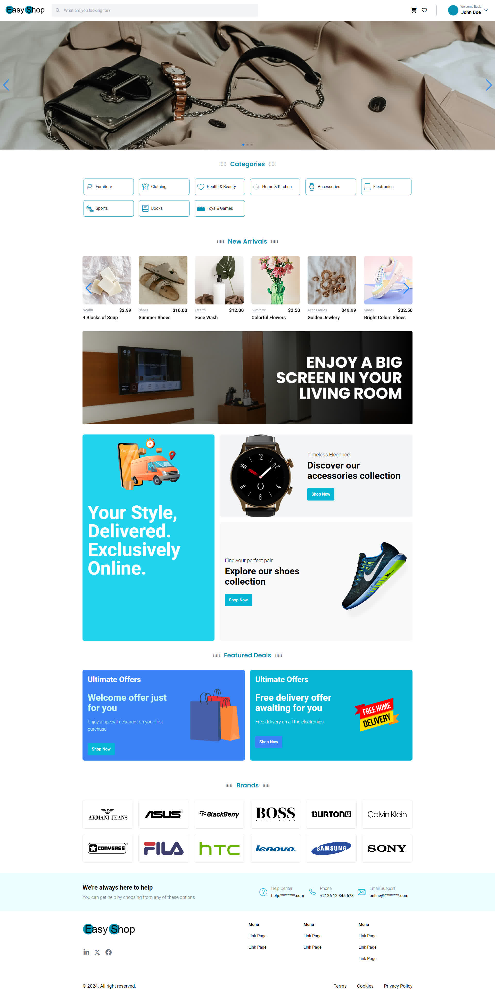

<div>
    <p align='center'>
        
    </p>
</div>

# E-commerce Website Template

A modern and responsive e-commerce website template, designed to showcase products beautifully with easy navigation, categorized product sections, and an intuitive user experience.

## Screenshot

<p align='center'>
    
</p>

## Features

* **Responsive Design** : Fully optimized for desktop, tablet, and mobile.
* **Product Categories** : Organized product categories for easy browsing.
* **Featured Products** : Highlight popular and new arrivals.
* **Search Functionality** : Quick product search.
* **User Authentication** : Sign up, log in, and profile management.
* **Cart and Checkout** : Add to cart and checkout options.

## Technologies Used

* **Frontend** : HTML, CSS (Tailwind), JavaScript
* **Backend** : PHP
* **Database** : ---
* **Icons** : Font Awesome, Icomoon

## Installation

1. Clone the repo:

```
git clone https://github.com/yourusername/your-repo-name.git
cd your-repo-name
```

2. Install dependencies:

```
npm install
```

3. Build

```
npm run build
```

4. Start the server:

```
npm run serve
```

5. Open your browser and go to `http://localhost:8000`

## Contributing

Contributions are welcome! Please fork this repo and create a pull request.
